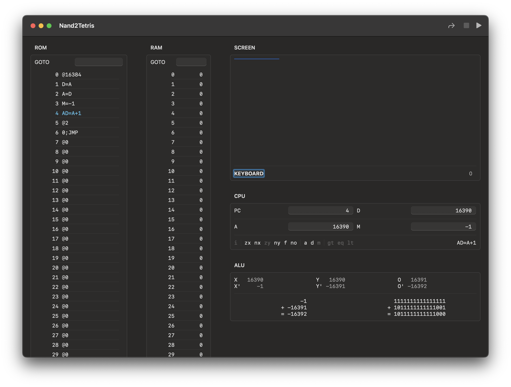

#  Nand2Tetris

This is a **work in progress** set of programs surrounding the excellent [nand2tetris](https://nand2tetris.org) course.

The goal of this project is to provide mac developers a native feeling and experience.
This will be achieved through both a set of SwiftUI apps mirroring the [official tools](https://www.nand2tetris.org/software)
and a set of Swift command-line programs to offer a more standard development experience. 

## Projects

### Nand2TetrisKit

This package provides an API for the Hack architecture, assembly and virtual machine.

It also provides standard documents for assembly, ROMs and virtual machine snapshots to
allow easier interop between projects.

### Nand2Tetris

This app contains the CPU emulator.

#### Features

- ROM editing with assembly parsing
- RAM editing using any base
- Go to any ROM or RAM address easily
- Working screen & keyboard
- All registers at a glance, even pseudo-register `M`
- View any register as unsigned, signed, hex, binary or assembly
- Current instruction and its decoded flags
- ALU operands and intermediate value, both in decimal and binary

## Roadmap

### Project reorganization

I want to rename the *Nand2Tetris* app to *Hack Emulator* and move the virtual machine view code from *Nand2TetrisKit* to it.

I want to add a command-line program named *nand2tetris*. I want all CLI programs to go through it as a subcommand.

### New Features in Hack Emulator

- Load ROM/snapshot. Save ROM/snapshot/screenshot
- Customizable toolbar
- Global format picker for registers & RAM. Select between signed, unsigned, hexadecimal and binary
- Clear RAM & ROM commands
- `CMD+L` Goto command, either in RAM `ram <number>`, ROM `rom <number>`, both `<number>` or special addresses. `screen`, `keyboard`, etc.

### Assembler

I want to add an assembly parser and hack code generator to *Nand2TetrisKit* and let the ROM document just assemble files on the go.
